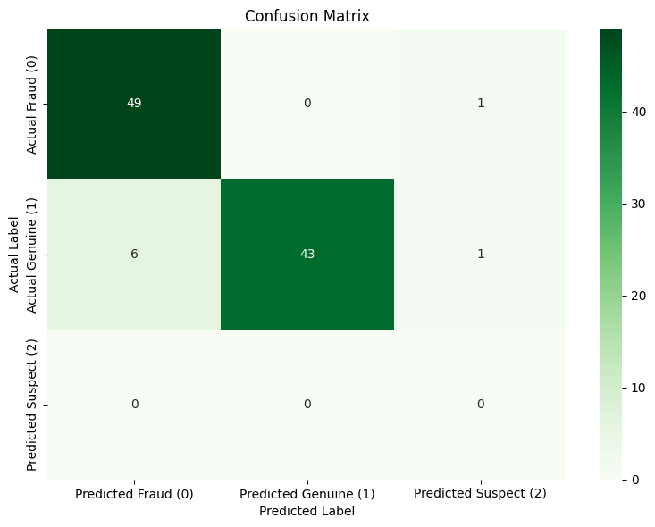

# Documentation

## App Analysis Workflow Project

This project automates the process of scraping mobile app data from the Google Play Store, analyzing it using a Large Language Model (LLM), and evaluating the analysis results to detect potentially fraudulent applications.

### Project Files

*   **combined.py**:  Combines the scraper, analyzer, and evaluator into a single workflow. Provides functions to run the full workflow or analyze existing JSON files.
*   **evaluator.py**: Contains functions for evaluating the LLM's analysis results, classifying apps as fraud, genuine, or suspected based on probability scores, and generating performance metrics.
*   **main.ipynb**: A Jupyter Notebook demonstrating how to use the workflow, including examples of scraping, analyzing pre-existing data, and evaluating results.
*   **model_analyzer.py**: Implements the LLM-based analysis of app data using the Gemini API. Includes functions to interact with the LLM, parse responses, and format data for analysis.
*   **scraper.py**: Contains functions for scraping app data from the Google Play Store using the `google_play_scraper` library. Handles proxy management, retries, and data saving.
*   **good_proxies.txt**: A placeholder file for a list of proxy IPs and ports (one per line) to be used for scraping. You should populate this file with your own proxies.
*   **app_analysis_results.csv**: Default output file for storing the LLM analysis results in CSV format.
*   **temp_analysis_results.csv**: Temporary CSV file used for testing the `model_analyzer` module.
*   **temp_evaluator_overwrite_test.csv**: Temporary CSV file used for testing the `evaluator` module's overwrite functionality.
*   **temp_scraper_output/**: Directory where scraped app data JSON files are stored during testing.
*   **test data/**: Contains sample JSON files (`fraud-apps.json`, `genuine-apps.json`) used for testing the analysis and evaluation workflows.
*   **test_analysis_results.csv**: CSV file containing analysis results for the sample test data, used for evaluation testing in `main.ipynb`.

### Setup Instructions

1.  **Install Dependencies**:
    ```bash
    pip install -r requirements.txt
    ```
    *(Make sure you have a `requirements.txt` file listing dependencies like `google-play-scraper`, `pandas`, `google-generativeai`, `python-dotenv`, `chardet`, `scikit-learn`, `matplotlib`, `seaborn`)*

2.  **Configure API Key**:
    *   Set the `GEMINI_API_KEY` environment variable with your Google Gemini API key. You can obtain one from [Google AI Studio](https://makersuite.google.com/).

3.  **Proxy Setup (Optional but Recommended)**:
    *   Populate `good_proxies.txt` with a list of working proxies (IP:Port format, one per line) to avoid IP blocking during scraping. If you don't have proxies, the scraper will attempt to run directly, but may be less reliable and could lead to IP blocking.

### Usage

1.  **Full Workflow (Scrape, Analyze, Evaluate)**:
    *   Run the `run_app_analysis_workflow_with_categories` function in `combined.py` or execute the relevant cells in `main.ipynb`.
    *   Customize categories to scrape in the `CATEGORIES_TO_SCRAPE` dictionary in `main.ipynb` or pass a dictionary to the function.
    *   Configuration overrides for scraping, analysis, and evaluation can be passed as dictionaries to the function.

2.  **Analyze and Evaluate Existing JSON Files**:
    *   Use the `analyze_and_evaluate_json_files` function in `combined.py` or the corresponding example in `main.ipynb`.
    *   Provide a list of paths to JSON files containing scraped app data.

3.  **Evaluation and Metrics**:
    *   The `evaluate_results` function in `evaluator.py` is automatically called in the workflows to evaluate analysis results.
    *   `main.ipynb` demonstrates how to load analysis results, compare them to labeled data (if available), and calculate/visualize classification metrics (accuracy, confusion matrix, classification report).

### combined.py Functions

*   **`run_app_analysis_workflow_with_categories(categories_to_scrape=None, scraper_config_override=None, analyzer_config_override=None, evaluation_params_override=None)`**
    *   **Purpose**: Executes the entire workflow, starting with scraping from the Google Play Store and ending with evaluating the LLM's analysis.
    *   **Usage (Example 1 - Scraping and Analysis)**:

        First, define the categories you want to scrape in `main.ipynb` or directly in your script:
        ```python
        CATEGORIES_TO_SCRAPE = {
            "Banking": "banking app",
            "Key " : "Key Word to search "
        }
        ```
        Then, run the workflow:
        ```python
        from combined import run_app_analysis_workflow_with_categories

        run_app_analysis_workflow_with_categories(categories_to_scrape=CATEGORIES_TO_SCRAPE)
        ```
        *   `categories_to_scrape`: A dictionary of categories to search.  Keys are category names, values are search terms.  If `None`, uses a default (empty by default - define in combined.py or pass).
        *   `scraper_config_override`: A dictionary to override the default scraper config.  Keys are config parameters, values are new settings.
        *   `analyzer_config_override`: A dictionary to override the default analyzer config.
        *   `evaluation_params_override`: A dictionary to override parameters passed to the evaluation function.
    *   The scraped app data and LLM analysis results will be saved to `app_analysis_results.csv` by default.

*   **`analyze_and_evaluate_json_files(json_file_list, analyzer_config_override=None, evaluation_params_override=None)`**
    *   **Purpose**: Analyzes and evaluates a list of pre-existing JSON files containing app data.  Skips the scraping step.
    *   **Usage (Example 2 - Analyzing existing JSON data)**:
        First, ensure you have scraped data saved in JSON files in a known location. For example:

        ```
        test data/fraud-apps.json
        test data/genuine-apps.json
        ```
        Then, specify the paths to these files in a list and run the function:

        ```python
        from combined import analyze_and_evaluate_json_files

        json_files_to_analyze = ['test data/fraud-apps.json', 'test data/genuine-apps.json','file path']
        analyze_and_evaluate_json_files(json_file_list=json_files_to_analyze)
        ```

        *   `json_file_list`: A list of strings, where each string is the path to a JSON file containing scraped app data.
        *   `analyzer_config_override`: A dictionary to override the default analyzer config.
        *   `evaluation_params_override`: A dictionary to override parameters passed to the evaluation function.
    *   The analysis of pre-existing JSON data will be saved to `app_analysis_results.csv` by default.

### Performance Analysis

*   To analyze performance with labeled datasets, you can:
    1.  Prepare CSV files with columns: `app_id`, `reason`, `probabilities`, and a ground truth label column (e.g., `original_label` as in `main.ipynb`).
    2.  Modify `main.ipynb` to load your labeled data CSV.
    3.  Adjust the evaluation section in `main.ipynb` to compare the 'type' column (predicted labels) with your ground truth label column.
    4.  Run the evaluation metrics code in `main.ipynb` to get accuracy, confusion matrix, and classification report on your labeled dataset.

### Notes

*   Ensure you have a valid Google Gemini API key and that it is correctly set as an environment variable.
*   Using proxies is highly recommended for scraping to prevent IP blocking. Regularly update your proxy list in `good_proxies.txt`.
*   The LLM analysis quality depends on the prompt in `model_analyzer.py` and the capabilities of the Gemini model. Prompt engineering and model selection can impact results.
*   The evaluation metrics provide insights into the workflow's classification accuracy, but further analysis and fine-tuning may be needed for specific use cases.

---

# FUNCTIONS_AND_FLOW

## Function and Workflow Documentation

This document describes the functions in each Python file and the overall workflow of the app analysis project.

### 1. scraper.py

This file is responsible for scraping app data from the Google Play Store.

**Functions:**

*   **`load_proxies(filename)`**:
    *   **Purpose**: Loads proxy IPs and ports from a file.
    *   **Input**: `filename` (str) - Path to the proxy file (e.g., 'good_proxies.txt'). Each line should contain one proxy in `IP:Port` format.
    *   **Output**: `proxies` (list of str) - List of proxies loaded from the file. Returns an empty list if the file is not found or empty.

*   **`set_proxy_env(proxy_ip_port)`**:
    *   **Purpose**: Sets or clears HTTP/HTTPS proxy environment variables.
    *   **Input**: `proxy_ip_port` (str or None) - Proxy in `IP:Port` format (e.g., '127.0.0.1:8080') or `None` to clear proxy settings.
    *   **Output**: `proxy_url` (str or None) - The proxy URL that was set, or `None` if proxies were cleared.

*   **`json_datetime_serializer(obj)`**:
    *   **Purpose**: Custom JSON serializer to handle datetime objects.
    *   **Input**: `obj` (datetime.datetime or datetime.date) - A datetime or date object.
    *   **Output**: `iso_string` (str) - ISO formatted string representation of the datetime object.
    *   **Raises**: `TypeError` if the object is not a datetime or date.

*   **`ensure_output_directory(dir_path)`**:
    *   **Purpose**: Creates the output directory if it doesn't exist.
    *   **Input**: `dir_path` (str) - Path to the directory to create.
    *   **Output**: `True` if the directory exists or was created successfully, `False` otherwise.

*   **`search_apps_with_retry(search_term, num_apps_target, search_hits, config)`**:
    *   **Purpose**: Searches for app IDs on Google Play Store with retry logic and proxy rotation.
    *   **Input**:
        *   `search_term` (str) - Search query (e.g., "dating app").
        *   `num_apps_target` (int) - Target number of app IDs to retrieve.
        *   `search_hits` (int) - Number of search results to request from Google Play (should be >= `num_apps_target` + buffer).
        *   `config` (dict) - Scraper configuration dictionary (from `SCRAPER_CONFIG`).
    *   **Output**: `app_ids` (list of str) - List of unique app IDs found. Can be empty if search fails or returns no results.

*   **`get_app_details_with_retry(app_id, config)`**:
    *   **Purpose**: Fetches detailed app information for a given app ID with retry and proxy rotation.
    *   **Input**:
        *   `app_id` (str) - Google Play Store app ID (e.g., "com.example.app").
        *   `config` (dict) - Scraper configuration dictionary.
    *   **Output**: `app_details` (dict or None) - Dictionary containing app details if successful, `None` if fetching fails (e.g., app not found, network errors after retries).

*   **`fetch_multiple_app_details_parallel(app_ids, config)`**:
    *   **Purpose**: Fetches app details for multiple app IDs in parallel using threading.
    *   **Input**:
        *   `app_ids` (list of str) - List of app IDs to fetch details for.
        *   `config` (dict) - Scraper configuration dictionary.
    *   **Output**: `detailed_apps` (list of dict) - List of app detail dictionaries that were successfully fetched.

*   **`save_app_details(data, filename)`**:
    *   **Purpose**: Saves a list of app detail dictionaries to a JSON file.
    *   **Input**:
        *   `data` (list of dict) - List of app detail dictionaries.
        *   `filename` (str) - Path to the JSON output file.
    *   **Output**: `True` if saving was successful, `False` otherwise.

*   **`scrape_categories(categories_dict, config)`**:
    *   **Purpose**: Orchestrates the scraping process for multiple categories. For each category, it searches for app IDs, fetches details, and saves the data to a JSON file.
    *   **Input**:
        *   `categories_dict` (dict) - Dictionary where keys are category IDs (str) and values are search terms (str). Example: `{"Dating": "dating apps"}`.
        *   `config` (dict) - Scraper configuration dictionary.
    *   **Output**: `created_files` (list of str) - List of paths to the JSON files created (one per category).

### 2. model_analyzer.py

This file handles the analysis of scraped app data using the Gemini LLM.

**Functions:**

*   **`get_gemini_client(api_key)`**:
    *   **Purpose**: Initializes and returns a Gemini client.
    *   **Input**: `api_key` (str) - Your Gemini API key.
    *   **Output**: `client` (genai.GenerativeModel) - Gemini client object.
    *   **Raises**: `ValueError` if `GEMINI_API_KEY` is not set or client initialization fails.

*   **`analyze_app_data(client, app_data, model_name, char_limit)`**:
    *   **Purpose**: Sends app data to the Gemini LLM for analysis and retrieves the JSON response.
    *   **Input**:
        *   `client` (genai.GenerativeModel) - Initialized Gemini client.
        *   `app_data` (dict) - Dictionary containing app information (scraped data). Must include 'appId'.
        *   `model_name` (str) - Name of the Gemini model to use (from `ANALYZER_CONFIG`).
        *   `char_limit` (int) - Character limit for the "reason" field in the LLM response.
    *   **Output**: `analysis_result` (dict or None) - Dictionary containing the LLM's analysis (`reason` and `probabilities`). Returns `None` if analysis fails (API errors, parsing issues, validation errors).

*   **`append_to_csv(csv_filepath, app_id, analysis_result)`**:
    *   **Purpose**: Appends the analysis result for a given app ID to a CSV file.
    *   **Input**:
        *   `csv_filepath` (str) - Path to the CSV file.
        *   `app_id` (str) - App ID.
        *   `analysis_result` (dict or None) - Analysis result dictionary from `analyze_app_data` or `None` if analysis failed.
    *   **Output**: None. Appends a row to the CSV file.

*   **`get_processed_app_ids(csv_filepath)`**:
    *   **Purpose**: Reads a CSV file and returns a set of app IDs that have already been processed (present in the 'app_id' column).
    *   **Input**: `csv_filepath` (str) - Path to the analysis results CSV file.
    *   **Output**: `processed_ids` (set of str) - Set of app IDs already in the CSV.

*   **`load_and_analyze_apps(json_file_paths, config)`**:
    *   **Purpose**: Main function to load app data from JSON files, analyze each app using the LLM, and save results to a CSV.
    *   **Input**:
        *   `json_file_paths` (list of str) - List of paths to JSON files containing scraped app data (output from `scraper.py`).
        *   `config` (dict) - Analyzer configuration dictionary (from `ANALYZER_CONFIG`).
    *   **Output**: None. Saves analysis results to the CSV file specified in `config['CSV_FILE']`.

### 3. evaluator.py

This file evaluates the analysis results from `model_analyzer.py`.

**Functions:**

*   **`parse_probabilities(json_str)`**:
    *   **Purpose**: Parses the JSON string from the 'probabilities' column in the analysis CSV into a Python dictionary.
    *   **Input**: `json_str` (str) - JSON string representing probabilities.
    *   **Output**: `probabilities` (dict or None) - Dictionary of probabilities (e.g., `{'fraud': 0.8, 'genuine': 0.1, 'suspected': 0.1}`) or `None` if parsing fails.

*   **`classify_probability(row, fraud_threshold=0.7, genuine_threshold=0.7, suspect_threshold=0.4)`**:
    *   **Purpose**: Classifies an app as 'fraud', 'genuine', 'suspected', or 'undetermined' based on the probability scores from the LLM analysis.
    *   **Input**:
        *   `row` (pandas Series) - A row from the analysis results DataFrame, containing probability scores ('fraud', 'genuine', 'suspected').
        *   `fraud_threshold` (float, optional) - Probability threshold for 'fraud' classification. Default: 0.7.
        *   `genuine_threshold` (float, optional) - Probability threshold for 'genuine' classification. Default: 0.7.
        *   `suspect_threshold` (float, optional) - Probability threshold for 'suspected' classification. Default: 0.4.
    *   **Output**: `classification` (str) - Predicted class label ('fraud', 'genuine', 'suspected', or 'undetermined').

*   **`evaluate_results(csv_filepath, **kwargs)`**:
    *   **Purpose**: Loads the analysis CSV, processes probabilities, classifies apps, adds a numerical 'type' column, and saves the evaluated results back to the *same* CSV file (overwrites it).
    *   **Input**:
        *   `csv_filepath` (str) - Path to the analysis results CSV file (input from `model_analyzer.py`).
        *   `**kwargs` - Optional keyword arguments to pass to `classify_probability` (e.g., to override thresholds).
    *   **Output**: `evaluated_df` (pandas DataFrame or None) - The processed DataFrame that was saved to CSV, or `None` if reading/processing/saving failed. The DataFrame contains 'app_id', 'reason', and 'type' columns.

### 4. combined.py

This file combines the scraper, analyzer, and evaluator into complete workflows.

**Functions:**

*   **`run_app_analysis_workflow_with_categories(categories_to_scrape=None, scraper_config_override=None, analyzer_config_override=None, evaluation_params_override=None)`**:
    *   **Purpose**: Executes the full app analysis workflow: scraping, LLM analysis, and evaluation.
    *   **Input**:
        *   `categories_to_scrape` (dict, optional) - Categories to scrape (category ID to search term mapping). If `None`, uses `DEFAULT_CATEGORIES_TO_SCRAPE` (which is empty by default in `combined.py`, so you'd need to define it or pass a dictionary).
        *   `scraper_config_override` (dict, optional) - Dictionary to override default scraper configuration.
        *   `analyzer_config_override` (dict, optional) - Dictionary to override default analyzer configuration.
        *   `evaluation_params_override` (dict, optional) - Dictionary of parameters to override default evaluation parameters (passed to `evaluate_results`).
    *   **Output**: None. Saves final evaluated results to the CSV file specified in `ANALYZER_CONFIG['CSV_FILE']`.

*   **`analyze_and_evaluate_json_files(json_file_list, analyzer_config_override=None, evaluation_params_override=None)`**:
    *   **Purpose**: Executes the analysis and evaluation workflow on a list of pre-existing JSON files (skips scraping).
    *   **Input**:
        *   `json_file_list` (list of str) - List of paths to JSON files containing scraped app data.
        *   `analyzer_config_override` (dict, optional) - Dictionary to override default analyzer configuration.
        *   `evaluation_params_override` (dict, optional) - Dictionary of parameters to override default evaluation parameters.
    *   **Output**: None. Saves evaluated results to the CSV file specified in `ANALYZER_CONFIG['CSV_FILE']`.

### 5. main.ipynb

This Jupyter Notebook provides examples and demonstrates how to use the functions in the other Python files to run the app analysis workflow. It includes code for:

*   Importing necessary functions.
*   Defining categories to scrape.
*   Running the full scraping, analysis, and evaluation workflow using `run_app_analysis_workflow_with_categories`.
*   Analyzing and evaluating pre-existing JSON files using `analyze_and_evaluate_json_files`.
*   Loading analysis results from CSV.
*   Loading sample labeled datasets (genuine and fraud apps).
*   Comparing predicted labels with original labels.
*   Calculating and visualizing classification metrics (accuracy, confusion matrix, classification report) using `scikit-learn` and `seaborn/matplotlib`.

### Workflow Flow

1.  **Scraping (scraper.py)**:
    *   `scrape_categories` (orchestration) -> `search_apps_with_retry` (search app IDs) -> `fetch_multiple_app_details_parallel` (parallel fetching) -> `get_app_details_with_retry` (fetch single app details) -> `save_app_details` (save to JSON).

2.  **Analysis (model_analyzer.py)**:
    *   `load_and_analyze_apps` (orchestration) -> `get_gemini_client` (initialize LLM client) -> `analyze_app_data` (LLM analysis per app) -> `append_to_csv` (save analysis results).

3.  **Evaluation (evaluator.py)**:
    *   `evaluate_results` (orchestration) -> `parse_probabilities` (parse probabilities from CSV) -> `classify_probability` (classify app type) -> saves evaluated CSV (overwrites input CSV).

4.  **Combined Workflow (combined.py)**:
    *   `run_app_analysis_workflow_with_categories` (full workflow: scrape -> analyze -> evaluate).
    *   `analyze_and_evaluate_json_files` (analyze & evaluate existing JSON files -> evaluate).

5.  **Notebook (main.ipynb)**:
    *   Demonstrates usage of `combined.py` functions.
    *   Includes evaluation metrics calculation and visualization.
*   


## Performance analysis with labeled datasets

This project automates the process of scraping mobile app data from the Google Play Store, analyzing it using a Large Language Model (LLM), and evaluating the analysis results to detect potentially fraudulent applications.


**Key Metrics:**

*   **Accuracy**: 92.00%

*   **Confusion Matrix**:

    ```
                       Predicted Fraud (0)     Predicted Genuine (1)  Predicted Suspect (2)
    Actual Fraud (0)                49                      0                      1
    Actual Genuine (1)               6                     43                      1
    Predicted Suspect (2)            0                      0                      0
    


    ```
    


    *   **Interpretation**:
        *   **True Positives (Genuine Apps Correctly Classified)**: 43
        *   **True Negatives (Fraud Apps Correctly Classified)**: 49
        *   **False Positives (Fraud Apps Incorrectly Classified as Genuine)**: 1
        *   **False Negatives (Genuine Apps Incorrectly Classified as Fraud)**: 7
        *   The model shows good performance in distinguishing between fraud and genuine apps in this test dataset. Class '2' (Suspect) was not predicted in this run, resulting in 0.00 precision, recall and F1-score for that class. This may indicate the model is biased towards 'fraud' and 'genuine' classifications with the current thresholds and prompt.
*   **Classification Report**:

    ```
              precision    recall  f1-score  support
    0           0.89        0.98      0.93    50.00
    1            1.0        0.86      0.92    50.00
    2                0         0         0     0.00
    accuracy                          0.92   100.00
    weighted avg 0.94       0.92      0.92   100.00
    ```
    *   **Interpretation**:
        *   **Class 0 (Fraud):** High recall (98%) indicates the model is good at identifying most of the actual fraud apps. Precision (89%) suggests that when the model predicts "fraud", it is correct ~89% of the time.
        *   **Class 1 (Genuine):** Perfect precision (100%) means when the model predicts "genuine", it is always correct in this test. Recall (86%) indicates that it correctly identifies 86% of the actual genuine apps.
        *   **Class 2 (Suspect):**  All metrics are 0.00 as no apps were classified as 'suspect' in this test run.

**Conclusion:**

The initial performance results on the test dataset are promising, with an accuracy of 92%. The model demonstrates a strong ability to differentiate between genuine and fraudulent applications based on the analyzed features and LLM reasoning. However, the lack of 'suspect' classifications and the class imbalance in the confusion matrix suggest potential areas for further investigation and refinement, such as:

*   Adjusting classification thresholds in `evaluator.py`.
*   Prompt engineering in `model_analyzer.py` to encourage 'suspect' classifications when appropriate.
*   Evaluating performance on larger and more diverse datasets.
*   Investigating why genuine apps are sometimes misclassified as fraud (False Negatives).

These results provide a baseline for further development and optimization of the app fraud detection workflow.

### Notes

*   Ensure you have a valid Google Gemini API key and that it is correctly set as an environment variable.
*   Using proxies is highly recommended for scraping to prevent IP blocking. Regularly update your proxy list in `good_proxies.txt`.
*   The LLM analysis quality depends on the prompt in `model_analyzer.py` and the capabilities of the Gemini model. Prompt engineering and model selection can impact results.
*   The evaluation metrics provide insights into the workflow's classification accuracy, but further analysis and fine-tuning may be needed for specific use cases.

---

## Future Work

*   **Prompt Engineering:** Further experimentation and refinement of the prompts used in `model_analyzer.py` to improve the accuracy and reliability of the LLM-based analysis. This includes exploring different prompt structures, adding more context, and testing various prompt engineering techniques.
*   **Review Analysis:** Implement analysis of app reviews in addition to app descriptions to improve fraud detection accuracy. This could involve sentiment analysis, topic modeling, and identifying patterns in user feedback.
*   **Data Transfer Techniques:** Explore alternative data transfer methods between Python files instead of relying on CSV files. This could include using in-memory data structures or more efficient serialization formats.
*   **Proxy Management:** Enhance the scraper to automatically remove bad proxies and add new proxies to the `good_proxies.txt` file.
*   **Scraping Improvements:** Reduce sleep time during scraping and increase the number of apps scraped per search query to improve efficiency.
*   **Derived Attributes:** Create new derived attributes in `model_analyzer.py` based on the scraped data to provide additional features for the LLM to analyze. These attributes could be combinations of existing data or new metrics calculated from the scraped information.

